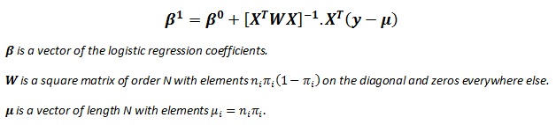

Abstract
========

As part of the final project in Mathematical Pattern Classification
course, this research would explore different classification techniques
throughout the course to find the best classification model for Adult
Data set. The goal of the adult data set is to design the best model
that would predict if the income of a certain person is more than \$50k
based on many factors including education, country etc. The data
examination showed that adult data is a categorical data set with
distributions. This indicates that the data should be encoded using 0s
and 1s instead just their numbers. After feature reduction using select
from model algorithm the data set (Small Data Set) was then subjected to
different classification techniques including, Perceptron using one
versus rest classifier, Logistic regression with Random Embedded trees
and Random Forest, SVM(Support vector machines) using radial basis
Kernel, Multinomial Naïve Bayes Classifier and finally Artificial Neural
Network (ANN) with 2D hidden layer of 15 by 2 using multi-layer
perceptron (MLP). The most accurate classification is Logistic
Regression with ensemble of trees using random Forest Classifier with
accuracy of 86%-f1 score of 0.64 and AUC area of 0.9.

2.  Introduction
    ============

    1.  Problem Statement and Goals
        ===========================

> The Adult Data set is a two-class classifier problem. The goal is to
> tell if a person makes more than or less than \$50k annually. This
> indicates that we can use binary classifier techniques to tackle this
> problem. Preprocessing is the first and most important step of
> analyzing the data. The right type of encoding has to be used for
> categorical features. The classifier has to be carefully picked
> according to number of classes.

Approach and Implementation
===========================

3.0. Importing Data
-------------------

> To Import the file, I used pandas readcsv function. This function
> allows parsing through data easily and saving file to data frames. The
> data was already divided to data frames f1-f14, after reading the
> original file on the UC Irvine dataset, I decided to change the header
> names to respectable names. This is merely done to help with reading
> the data information for future preprocessing.

Analyzing the Distribution and the correlation of the data
----------------------------------------------------------

> Firstly, I drew a complete table of feature's distribution with
> respect to the classifier, which is whether someone makes more than
> \$50k or not.
>
> {width="5.997916666666667in"
> height="5.564583333333333in"}The resulting distribution table is as
> follows.

Figure 1. Showing the Distribution of the data

> As can be seen in figure 1 the number analyzed people are mostly
> residing in America. We will use this later in preprocessing the data.
>
> Next we need to find the correlation between features on the data

{width="3.7915890201224847in"
height="3.235488845144357in"}

Figure 2. The correlation heatmap of the Data

> As can be seen in the data there is a high correlation between the
> Education and Education Number. There is also high correlation between
> sex and marriage columns this can help us in the feature reduction
> later on.

Preprocessing
-------------

> In this section various techniques are done to prepare and preprocess
> data.

###  3.2.1 Encoding

> The variables come in categorical names and string. I needed to come
> up way to only represent all the categories with numbers so it will be
> easier for the program to analyze them. The first approach is to use
> the encode function of the sklearn\[3\]\[2\]. This would only change
> the categorical features to numbers. While this might be a good way to
> encode the data, we would later see that this is not the best method
> to encode the categorical features with correlation. The following
> figure shows the distribution of the data after encoding.
>
> {width="6.0in" height="4.55625in"}
>
> Figure 3. The Picture shows both Imputed and Encoded data Set.
>
> Looking at the Label table we can see that we are dealing with an
> unbalanced dataset meaning that we have too much of a first class
> compare to another one. We would later fix this by resampling the
> data.

###  3.2.2 Imputing

Some of the features in the adult data are indicated as "?". To fix this
the data needs to be imputed so the feature would be filled. To do this
I defined a class called impute categorical that uses the in-built
sklearn sklearn function impute. I set the rules so the data would be
imputed using the most frequent approach.

###  3.2.3 Scaling

Finally, to make the data more processable I scaled the data between
\[-1,1\] using sklearn scale function.

Compensation for unbalanced data \[3\]
--------------------------------------

As I explained in the previous section the data is imbalanced and we
have to much of a one class. Firstly, to analyze the accuracy of our
classifiers we need to use f1 score instead of the accuracy score.

Moreover, to tackle imbalanced data I used under sampling technique.
This would resample the training data and remove any data that would
make one class more than the other. This method would, for every
observation of class 0, randomly sample from class 1 without replacement
and then join together class 0's target vector with the down sampled
class 1 targets. In scklearn it is defined as
resamplingdata\_downsample(X,y).

Feature extraction and dimensionality adjustment
------------------------------------------------

As explained in the first section, the data has two features that are
high correlated. We can remove these to reduce the dimensionality of the
feature space. I also used 'select feature from classification'model to
reduce the number of the features in the data. This feature selector
would reduce feature space based on the linear SVC modeling. As a
result, I got rid of 2 features and was working with 12 out of 14.

Dataset Usage
-------------

Using the training set and test set as is, is not going to be helpful
because we are handling unfairly distributed data. As I will show in the
result sections, just using the test and train set are not going to
provide a model with good ROC(Receiver Operation
Characteristic)\[3\]\[4\] curve. Train and test\_split functions were
used alongside with tree expansion functions like "random forest" to
increase the dimensionality of the data first then running it through a
pipeline for classification to achieve a better model and classifier. I
will Later explain this in the appropriate section. For cross validation
I divided the training set to 50% test and 50% train. It is important to
train the ensemble of trees (for embedded trees and random forest) on a
different subset of the training data than the linear regression model
to avoid overfitting, in particular if the total number of leaves is
similar to the number of training samples. As a result the test and
train were split twice.

3.5.1 Performance Evaluation Techniques
---------------------------------------

> ROC curve is used to test performance of a classifier by plotting
> false positive rate verses true positive rate. The larger AUC, the
> better classification result.

$$Recall = \frac{\text{TP}}{TP + FN}$$

$$Percision = \frac{\text{TP}}{TP + \text{FP}}$$

> F1 score which calculated by
> $2 \times \frac{precision \times recall}{precision + recall}$is also
> used to imply classification result. 0.5 is the most optimal F1 score.
> While it is the most optimal it can not really indicate the best
> clasiifier. A combination of Recall, Persision, Accuracy and ROC
> (Receiver Operating Characteristic) should be uaed to determine the
> best model.

 3.5.2 Overall Implementation
-----------------------------

{width="4.9375in" height="7.53125in"}

Training and Classification
---------------------------

1.  The first, suitable classifier I used for this data was ***logistic
    regression***. There are some differences between linear regression
    and logistic linear regression. In linear regression, the outcome
    (dependent variable) is continuous. It can have any one of an
    infinite number of possible values. In logistic regression, the
    outcome (dependent variable) has only a limited number of possible
    values. This will widely help us classify the distributed features.

> {width="2.9320898950131236in"
> height="1.0952023184601924in"}

The formula is similar to linear regression with different parameters.

{width="3.401922572178478in"
height="0.7692246281714785in"}

$$p\  = \ p(X)\  = \ S(X^{T}\beta) = \frac{1}{1 + e^{- X^{T}\beta}}$$

We are still defining a coefficient by which the regressor is going to
converge. In this method I used the lbfg( Ridge regression) method. In
Ridge Regressor the data might lead to under fitting but because we are
using many iterations of the data set, we can avoid under fitting while
not facing overfitting. The criterion of the Logistic regressor is as
follows:

> {width="1.6078630796150482in"
> height="0.4650853018372703in"}
>
> {width="2.3513888888888888in"
> height="2.3208333333333333in"}We have to choose lambda carefully to
> avoid under fitting. The max iteration allowed is 1000 .
>
> {width="2.8493372703412074in"
> height="3.037312992125984in"}
>
> Figure 4. Showing the confusion matrix and coefficients on LEFT and
> ROC curve on the Right.

As can be seen in the figure 1. The heatmap shows the confusion matrix
of the classification and the bar graph shows the coefficient of each
feature.

Below is a detailed table of the parameters and performance values

+-----------+-----------+-----------+-----------+-----------+-----------+
| Logistic  | Interpret |           |           |           |           |
| Regressio | ation     |           |           |           |           |
| n         |           |           |           |           |           |
+===========+===========+===========+===========+===========+===========+
| Feature   | ACC       | 82.50%    | TP        | 1732      | In        |
| select &  |           |           |           |           | Logistic  |
| balance   |           |           |           |           | Regressio |
|           |           |           |           |           | n         |
| Performan |           |           |           |           | method    |
| ce        |           |           |           |           | reduce    |
|           |           |           |           |           | feature   |
| With      |           |           |           |           | decrease  |
| binary    |           |           |           |           | the       |
| classifie |           |           |           |           | predict   |
| r         |           |           |           |           | accuracy, |
|           |           |           |           |           | and       |
|           |           |           |           |           | balance   |
|           |           |           |           |           | is also   |
|           |           |           |           |           | unnecessa |
|           |           |           |           |           | ry,       |
|           |           |           |           |           |           |
|           |           |           |           |           | Overall,  |
|           |           |           |           |           | this      |
|           |           |           |           |           | method is |
|           |           |           |           |           | good, it  |
|           |           |           |           |           | has a     |
|           |           |           |           |           | high      |
|           |           |           |           |           | accuracy  |
|           |           |           |           |           | in        |
|           |           |           |           |           | negative  |
|           |           |           |           |           | data and  |
|           |           |           |           |           | perform   |
|           |           |           |           |           | ok in     |
|           |           |           |           |           | positive  |
|           |           |           |           |           | site, and |
|           |           |           |           |           | the ROC   |
|           |           |           |           |           | is high   |
|           |           |           |           |           | (0.8).    |
+-----------+-----------+-----------+-----------+-----------+-----------+
|           | AUC       | 0.69      | TN        | 11707     |           |
+-----------+-----------+-----------+-----------+-----------+-----------+
|           | F1 score  | 0.54      | FP        | 728       |           |
+-----------+-----------+-----------+-----------+-----------+-----------+
|           |           |           | FN        | 2114      |           |
+-----------+-----------+-----------+-----------+-----------+-----------+

2.  The logistic regression can be enhanced by using ***Random Trees
    Embedding\[1\].*** In this method I split the training and test set
    twice because for fitting the data in random trees embedding, we
    cannot use the same training and testing set. After fitting the data
    through the random tree generator with depth of 3 and 10 estimators,
    I used a pipeline function to fit the random trees into my logistic
    regression with the leftover data.

{width="2.9541666666666666in"
height="2.6486111111111112in"}{width="2.9770833333333333in"
height="2.4743055555555555in"}This would take the data from lower
dimensions to higher dimensions to create a classifier. Therefore, we
can achieve a way better ROC curve as a result.

> Figure 5. Showing the confusion matrix and coefficients on LEFT and
> ROC curve on the Right.

+-----------+-----------+-----------+-----------+-----------+-----------+
| Logistic  | Interpret |           |           |           |           |
| Regressio | ation     |           |           |           |           |
| n         |           |           |           |           |           |
| With      |           |           |           |           |           |
| Random    |           |           |           |           |           |
| Trees     |           |           |           |           |           |
| Embedded  |           |           |           |           |           |
+===========+===========+===========+===========+===========+===========+
| Feature   | ACC       | 81.90%    | TP        | 587       | Logistic  |
| select &  |           |           |           |           | Regressio |
| balance   |           |           |           |           | n         |
|           |           |           |           |           | With      |
| Performan |           |           |           |           | random    |
| ce        |           |           |           |           | Embedded  |
|           |           |           |           |           | tree      |
| With      |           |           |           |           | shows to  |
| binary    |           |           |           |           | be a very |
| classifie |           |           |           |           | good      |
| r         |           |           |           |           | classifie |
|           |           |           |           |           | r         |
|           |           |           |           |           | for our   |
|           |           |           |           |           | data      |
|           |           |           |           |           | since ROC |
|           |           |           |           |           | curve for |
|           |           |           |           |           | this      |
|           |           |           |           |           | classifie |
|           |           |           |           |           | r         |
|           |           |           |           |           | has a     |
|           |           |           |           |           | larger    |
|           |           |           |           |           | area than |
|           |           |           |           |           | just      |
|           |           |           |           |           | logistic  |
|           |           |           |           |           | regressio |
|           |           |           |           |           | n.        |
|           |           |           |           |           | This is   |
|           |           |           |           |           | an        |
|           |           |           |           |           | ***unsupe |
|           |           |           |           |           | rvised*** |
|           |           |           |           |           | way of    |
|           |           |           |           |           | classifyi |
|           |           |           |           |           | ng        |
|           |           |           |           |           | data      |
|           |           |           |           |           | using     |
|           |           |           |           |           | pipelines |
|           |           |           |           |           | .         |
+-----------+-----------+-----------+-----------+-----------+-----------+
|           | AUC       | 0.84      | TN        | 3850      |           |
+-----------+-----------+-----------+-----------+-----------+-----------+
|           | F1 score  | 0.54      | FP        | 268       |           |
+-----------+-----------+-----------+-----------+-----------+-----------+
|           |           |           | FN        | 722       |           |
+-----------+-----------+-----------+-----------+-----------+-----------+

The dataset used to evaluate this classifier is obviously smaller
because a portion of the data was used to create a random embedded tree.

3.  Furthermore, the Logistic Regression can be improved by using
    ***Random Fores***t\[1\] classifier. This is done in my code using
    supervised techniques. Unlike other classifications I used one hot
    encoding for this classifier to handle the distributed categorical
    data better. The Max Depth was set to 3 and number of estimators
    are 10.

This method would also create a higher dimensional data of the features
to create a better classifier from logistic regression.

{width="2.73125in"
height="2.6944444444444446in"}{width="2.9993055555555554in"
height="3.066666666666667in"}

> Figure 5. Showing the confusion matrix and coefficients on LEFT and
> ROC curve on the Right.

+-----------+-----------+-----------+-----------+-----------+-----------+
| Logistic  | Interpret |           |           |           |           |
| Regressio | ation     |           |           |           |           |
| n         |           |           |           |           |           |
| With      |           |           |           |           |           |
| Random    |           |           |           |           |           |
| Forest    |           |           |           |           |           |
+===========+===========+===========+===========+===========+===========+
| Feature   | ACC       | 84.5%     | TP        | 703       | Logistic  |
| select &  |           |           |           |           | Regressio |
| balance   |           |           |           |           | n         |
|           |           |           |           |           | with      |
| Performan |           |           |           |           | Random    |
| ce        |           |           |           |           | Forest    |
|           |           |           |           |           | shows to  |
| With      |           |           |           |           | be a very |
| binary    |           |           |           |           | good      |
| classifie |           |           |           |           | classifie |
| r         |           |           |           |           | r         |
|           |           |           |           |           | with the  |
| And one   |           |           |           |           | highest   |
| hot       |           |           |           |           | ROC curve |
| encoding. |           |           |           |           | using     |
|           |           |           |           |           | logistic  |
|           |           |           |           |           | regressio |
|           |           |           |           |           | n.        |
|           |           |           |           |           | This is a |
|           |           |           |           |           | ***superv |
|           |           |           |           |           | ised***   |
|           |           |           |           |           | way of    |
|           |           |           |           |           | classifyi |
|           |           |           |           |           | ng        |
|           |           |           |           |           | data.     |
+-----------+-----------+-----------+-----------+-----------+-----------+
|           | AUC       | 0.9       | TN        | 3899      |           |
+-----------+-----------+-----------+-----------+-----------+-----------+
|           | F1 score  | 0.63      | FP        | 248       |           |
+-----------+-----------+-----------+-----------+-----------+-----------+
|           |           |           | FN        | 577       |           |
+-----------+-----------+-----------+-----------+-----------+-----------+

4.  I further explored the classification techniques. I next used
    ***perceptron classifier\[2\]*** to achieve better classification.
    We explored the perceptron classification in depth in class. 16281
    data points were used to test.

$$\left( i + 1 \right) = \left\{ \begin{matrix}
\left( i \right) + \eta Z_{n},\ \ if{}^{T}Z_{n} \leq 0 \\
\left( i \right),\ \ \ \ \ \ \ \ \ \ \ \ \ \ \ \ \ \ \ \ \ \ \ \ \ \ \ if{}^{T}Z_{n} > 0 \\
\end{matrix} \right.\ $$

In this classification method the weight of each discriminant function
is determined by iterating through each feature. If the criterion
function returned a negative or zero weight vector, then the next weigh
vector would be replaced
{width="3.2618055555555556in"
height="3.4770833333333333in"}with the current one and the iteration
proceeds.

{width="3.210944881889764in"
height="3.1689501312335957in"}

> Figure 6. Showing the confusion matrix and coefficients on LEFT and
> ROC curve on the Right for Perceptron Classifier.

+-----------+-----------+-----------+-----------+-----------+-----------+
| Perceptro | Interpret |           |           |           |           |
| n         | ation     |           |           |           |           |
| Classifie |           |           |           |           |           |
| r         |           |           |           |           |           |
+===========+===========+===========+===========+===========+===========+
| Feature   | ACC       | 74%       | TP        | 905       | The       |
| select &  |           |           |           |           | results   |
| balance   |           |           |           |           | show that |
|           |           |           |           |           | Perceptro |
| Performan |           |           |           |           | n         |
| ce        |           |           |           |           | by itself |
|           |           |           |           |           | is not a  |
| With      |           |           |           |           | really    |
| binary    |           |           |           |           | good way  |
| classifie |           |           |           |           | of        |
| r.        |           |           |           |           | classifyi |
| Using the |           |           |           |           | ng        |
| big test  |           |           |           |           | the data. |
| set.      |           |           |           |           | With a    |
|           |           |           |           |           | very poor |
|           |           |           |           |           | F1 score  |
|           |           |           |           |           | and ROC   |
|           |           |           |           |           | area this |
|           |           |           |           |           | is not a  |
|           |           |           |           |           | reliable  |
|           |           |           |           |           | classifie |
|           |           |           |           |           | r.        |
+-----------+-----------+-----------+-----------+-----------+-----------+
|           | AUC       | 0.57      | TN        | 11244     |           |
+-----------+-----------+-----------+-----------+-----------+-----------+
|           | F1 score  | 0.3       | FP        | 1191      |           |
+-----------+-----------+-----------+-----------+-----------+-----------+
|           |           |           | FN        | 2941      |           |
+-----------+-----------+-----------+-----------+-----------+-----------+

5.  The perceptron classifiers are a found mostly used in ***Artificial
    Neural Networks\[2\].*** As next step I explored using Perceptron as
    a function in a multilayer neural network with feed forward. In this
    method I used a 15 by 2 layers of ANN.

{width="2.613888888888889in"
height="2.5805555555555557in"}For my Multi-Layer perceptron (MLP), I
used 'lbfgs' which is an optimizer in the family of quasi-Newton
methods. The Alpha should be carefully chosen because it gives different
classifier shapes (discriminant function). It also works in **Augmented
space.**

> Figure 7. Showing the confusion matrix and coefficients on LEFT and
> ROC curve on the Right for Perceptron Classifier.

{width="3.7631944444444443in"
height="1.9479166666666667in"}

+-----------+-----------+-----------+-----------+-----------+-----------+
| Multi-Lay | Interpret |           |           |           |           |
| er        | ation     |           |           |           |           |
| Perceptro |           |           |           |           |           |
| n         |           |           |           |           |           |
| Clasifier |           |           |           |           |           |
+===========+===========+===========+===========+===========+===========+
| Feature   | ACC       | 84%       | TP        | 2383      | The       |
| select &  |           |           |           |           | results   |
| balance   |           |           |           |           | show that |
|           |           |           |           |           | MLP is a  |
| Performan |           |           |           |           | good Way  |
| ce        |           |           |           |           | to        |
|           |           |           |           |           | classify  |
| With      |           |           |           |           | the Data. |
| binary    |           |           |           |           | It        |
| classifie |           |           |           |           | provides  |
| r.        |           |           |           |           | a good    |
| Using the |           |           |           |           | ROC area  |
| big test  |           |           |           |           | and also  |
| set.      |           |           |           |           | a good F1 |
|           |           |           |           |           | score.    |
+-----------+-----------+-----------+-----------+-----------+-----------+
|           | AUC       | 0.76      | TN        | 11401     |           |
+-----------+-----------+-----------+-----------+-----------+-----------+
|           | F1 score  | 0.65      | FP        | 1034      |           |
+-----------+-----------+-----------+-----------+-----------+-----------+
|           |           |           | FN        | 1463      |           |
+-----------+-----------+-----------+-----------+-----------+-----------+

6.  For this section I have tried multiple classifiers that I will show
    in tables. For the sake of length of the report I would not show the
    plots. I used KNN, SVM with sigmoid and RBF and multinomial naïve
    Bayes.

+-----------+-----------+-----------+-----------+-----------+-----------+
| Support   | Interpret |           |           |           |           |
| Vector    | ation     |           |           |           |           |
| Machine   |           |           |           |           |           |
| with rbf  |           |           |           |           |           |
| as Kernel |           |           |           |           |           |
| Function  |           |           |           |           |           |
+===========+===========+===========+===========+===========+===========+
| Feature   | ACC       | 76%       | TP        | 566       | This is a |
| select &  |           |           |           |           | very poor |
| balance   |           |           |           |           | classifie |
|           |           |           |           |           | r         |
| Performan |           |           |           |           | for our   |
| ce        |           |           |           |           | data set. |
|           |           |           |           |           | Support   |
| With      |           |           |           |           | Vector    |
| binary    |           |           |           |           | machines  |
| classifie |           |           |           |           | are       |
| r.        |           |           |           |           | applicati |
| Using the |           |           |           |           | on        |
| big test  |           |           |           |           | specific  |
| set.      |           |           |           |           | and they  |
|           |           |           |           |           | don't     |
|           |           |           |           |           | seem to   |
|           |           |           |           |           | work well |
|           |           |           |           |           | here. The |
|           |           |           |           |           | are of    |
|           |           |           |           |           | ROC curve |
|           |           |           |           |           | On this   |
|           |           |           |           |           | Classifie |
|           |           |           |           |           | r         |
|           |           |           |           |           | (AUC) is  |
|           |           |           |           |           | very      |
|           |           |           |           |           | close to  |
|           |           |           |           |           | 0.5 which |
|           |           |           |           |           | is not    |
|           |           |           |           |           | useful.   |
+-----------+-----------+-----------+-----------+-----------+-----------+
|           | AUC       | 0.55      | TN        | 11958     |           |
+-----------+-----------+-----------+-----------+-----------+-----------+
|           | F1 score  | 0.23      | FP        | 477       |           |
+-----------+-----------+-----------+-----------+-----------+-----------+
|           |           |           | FN        | 3280      |           |
+-----------+-----------+-----------+-----------+-----------+-----------+

+-----------+-----------+-----------+-----------+-----------+-----------+
| Support   | Interpret |           |           |           |           |
| Vector    | ation     |           |           |           |           |
| Machine   |           |           |           |           |           |
| with      |           |           |           |           |           |
| sigmoid   |           |           |           |           |           |
| as Kernel |           |           |           |           |           |
| Function  |           |           |           |           |           |
+===========+===========+===========+===========+===========+===========+
| Feature   | ACC       | 70%       | TP        | 1376      | Once      |
| select &  |           |           |           |           | again     |
| balance   |           |           |           |           | Support   |
|           |           |           |           |           | Vector    |
| Performan |           |           |           |           | Machine   |
| ce        |           |           |           |           | Algorithm |
|           |           |           |           |           | Doesn't   |
| With      |           |           |           |           | seem to   |
| binary    |           |           |           |           | be the    |
| classifie |           |           |           |           | best      |
| r.        |           |           |           |           | classifie |
| Using the |           |           |           |           | r.        |
| big test  |           |           |           |           |           |
| set.      |           |           |           |           |           |
+-----------+-----------+-----------+-----------+-----------+-----------+
|           | AUC       | 0.58      | TN        | 10048     |           |
+-----------+-----------+-----------+-----------+-----------+-----------+
|           | F1 score  | 0.36      | FP        | 2387      |           |
+-----------+-----------+-----------+-----------+-----------+-----------+
|           |           |           | FN        | 2470      |           |
+-----------+-----------+-----------+-----------+-----------+-----------+

+-----------+-----------+-----------+-----------+-----------+-----------+
| Naïve     | Interpret |           |           |           |           |
| Bayes     | ation     |           |           |           |           |
| Classifie |           |           |           |           |           |
| r         |           |           |           |           |           |
+===========+===========+===========+===========+===========+===========+
| Feature   | ACC       | 78%       | TP        | 889       | Naïve     |
| select &  |           |           |           |           | Bayes     |
| balance   |           |           |           |           | Classifie |
|           |           |           |           |           | r         |
| Performan |           |           |           |           | has a     |
| ce        |           |           |           |           | very low  |
|           |           |           |           |           | ROC are   |
| With      |           |           |           |           | and a     |
| binary    |           |           |           |           | poor f1   |
| classifie |           |           |           |           | score.    |
| r.        |           |           |           |           | This is   |
| Using the |           |           |           |           | not a     |
| big test  |           |           |           |           | good      |
| set.      |           |           |           |           | classifie |
|           |           |           |           |           | r         |
|           |           |           |           |           | for our   |
|           |           |           |           |           | data.     |
+-----------+-----------+-----------+-----------+-----------+-----------+
|           | AUC       | 0.69      | TN        | 11902     |           |
+-----------+-----------+-----------+-----------+-----------+-----------+
|           | F1 score  | 0.33      | FP        | 533       |           |
+-----------+-----------+-----------+-----------+-----------+-----------+
|           |           |           | FN        | 2957      |           |
+-----------+-----------+-----------+-----------+-----------+-----------+

+-----------+-----------+-----------+-----------+-----------+-----------+
| KNN       | Interpret |           |           |           |           |
| Classifie | ation     |           |           |           |           |
| r         |           |           |           |           |           |
| (3        |           |           |           |           |           |
| Nearest   |           |           |           |           |           |
| neighbor  |           |           |           |           |           |
| was used) |           |           |           |           |           |
+===========+===========+===========+===========+===========+===========+
| Feature   | ACC       | 81%       | TP        | 2383      | K nearest |
| select &  |           |           |           |           | neighbor  |
| balance   |           |           |           |           | classifie |
|           |           |           |           |           | r         |
| Performan |           |           |           |           | is not a  |
| ce        |           |           |           |           | very bad  |
|           |           |           |           |           | classifie |
| With      |           |           |           |           | r         |
| binary    |           |           |           |           | however   |
| classifie |           |           |           |           | compare   |
| r.        |           |           |           |           | to other  |
| Using the |           |           |           |           | classifie |
| big test  |           |           |           |           | r         |
| set.      |           |           |           |           | in the    |
|           |           |           |           |           | previous  |
|           |           |           |           |           | section   |
|           |           |           |           |           | it. The   |
|           |           |           |           |           | AUC score |
|           |           |           |           |           | is still  |
|           |           |           |           |           | low       |
+-----------+-----------+-----------+-----------+-----------+-----------+
|           | AUC       | 0.73      | TN        | 11401     |           |
+-----------+-----------+-----------+-----------+-----------+-----------+
|           | F1 score  | 0.59      | FP        | 1034      |           |
+-----------+-----------+-----------+-----------+-----------+-----------+
|           |           |           | FN        | 1463      |           |
+-----------+-----------+-----------+-----------+-----------+-----------+

Comparison, Results, and Interpretation
=======================================

{width="2.73125in"
height="2.6944444444444446in"}Comparing the results of the tables the
best classifiers for our data is the logistic regression with dimension
expansion of random forest with f1 score of 0.61 AUC of 0.9 and Accuracy
of 86%. The rest of the comparisons are made in the interpretation part
of the tables.

Contributions of each team member
=================================

I have Completed this project individually.

Summary and conclusions
=======================

Consequently, I believe to classify any data, many preprocessing steps
needs to be taken to come up with the best classifiers. Firstly, one
needs to check, by plotting, how the features and classes are related. I
checked if the data can be linearly separated. Secondly, I reduced the
feature space by finding the correlation of the features with each
other. Eventually to improve the performance of the classifier I Used
random forest tree expansion to take the data to higher dimension.

Each sample goes through the decisions of each tree of the ensemble and
ends up in one leaf per tree. The sample is encoded by setting feature
values for these leaves to 1 and the other feature values to 0. The
resulting transformer has then learned a supervised, sparse,
high-dimensional categorical embedding of the data.

References
==========

[[https://scikit-learn.org/stable/auto\_examples/ensemble/plot\_feature\_transformation.html\#sphx-glr-auto-examples-ensemble-plot-feature-transformation-py]{.underline}](https://scikit-learn.org/stable/auto_examples/ensemble/plot_feature_transformation.html#sphx-glr-auto-examples-ensemble-plot-feature-transformation-py)

[[https://scikit-learn.org/stable/modules/neural\_networks\_supervised.html]{.underline}](https://scikit-learn.org/stable/modules/neural_networks_supervised.html)

[[https://towardsdatascience.com/l1-and-l2-regularization-methods-ce25e7fc831c]{.underline}](https://towardsdatascience.com/l1-and-l2-regularization-methods-ce25e7fc831c)

[[https://towardsdatascience.com/understanding-auc-roc-curve-68b2303cc9c5]{.underline}](https://towardsdatascience.com/understanding-auc-roc-curve-68b2303cc9c5)

[[https://www.valentinmihov.com/2015/04/17/adult-income-data-set/]{.underline}](https://www.valentinmihov.com/2015/04/17/adult-income-data-set/)

[[https://towardsdatascience.com/methods-for-dealing-with-imbalanced-data-5b761be45a18]{.underline}](https://towardsdatascience.com/methods-for-dealing-with-imbalanced-data-5b761be45a18)

[[https://scikit-learn.org/stable/auto\_examples/model\_selection/plot\_roc.html]{.underline}](https://scikit-learn.org/stable/auto_examples/model_selection/plot_roc.html)

[[https://homes.cs.washington.edu/\~jrl/teaching/cse525wi15/lectures/lecture10.pdf]{.underline}](https://homes.cs.washington.edu/~jrl/teaching/cse525wi15/lectures/lecture10.pdf)

\[1\]. \" Feature transformation using ensemble of trees\" Accessed:
April 25 2019. \[2\]. \"Nueral Network Models\" Accessed: April 24 2019.
\[3\]. \" L1 and L2 Regularization Methods\". Accessed: April 24 2019.
\[4\]. \"AUC and ROC\". Accessed: April 23 2019. \[5\]. \"Valentine
Mihiv Blog\" Accessed: April 10 2019. \[6\]. \"Dealing With Imbalanced
Data\". \[7\]. \"Receiver Operating Characteristic\".\[8\]. \"Lecture
10: Memoryless random variables and low-diameter partitions \".
